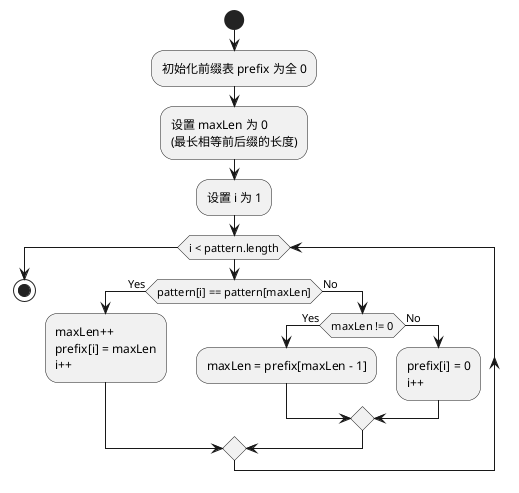

## 引言

KMP (Knuth-Morris-Pratt) 算法是一种用于高效字符串匹配的算法。它通过一个被称为前缀表的数据结构来优化匹配过程，避免了在文本串中的无效重复比较。本文将深入探讨前缀表的计算方法及其在 KMP 算法中的应用。

## 前缀表的概念和计算

前缀表是 KMP 算法的核心，用于存储模式串中每个子串的最长相等前后缀长度。理解前缀表的计算是理解 KMP 算法的关键。

**前缀表的目的** ：在 KMP 算法中，前缀表用于存储模式串（我们要匹配的字符串）中每个子串的最长相等前后缀的长度。这个信息用于优化字符串匹配过程，减少不必要的比较。

**相等前后缀的定义** ：对于字符串中的任意位置，相等的前后缀是指从字符串开头到该位置的子串中，开始和结束的部分相同，但不包括整个子串。

### 模式串和前缀表实例

* **模式串** : `"ABABCABAB"`
* **前缀表** : `[0, 0, 1, 2, 0, 1, 2, 3, 4]`

在这个实例中，前缀表的每个值表示在模式串 `"ABABCABAB"` 中，直到该位置为止的子串的最长相等前后缀的长度。例如：

* 在第三个字符 `'A'`（索引为 2）的位置，最长相等前后缀是 `"A"`，长度为 1。
* 在最后一个字符 `'B'`（索引为 8）的位置，最长相等前后缀是 `"ABAB"`，长度为 4。

### KMP 算法中计算前缀表的全过程

在 KMP 算法中，计算前缀表是核心步骤之一。这个过程不仅涉及逐步构建前缀表，而且还包括在特定情况下的回退机制。下面详细介绍这一过程，并着重强调回退过程。

1. **初始化** ：我们创建一个数组作为前缀表，其长度等于模式串的长度，所有元素初始化为 0。这个表将记录每个子串的最长相等前后缀的长度。
2. **遍历模式串** ：从模式串的第二个字符开始遍历（因为第一个字符的最长相等前后缀长度总是 0），我们将尝试找到每个位置的最长相等前后缀。
3. **匹配与不匹配**:

   - 如果当前字符与最长相等前后缀的下一个字符匹配，我们就增加最长相等前后缀的长度，并在前缀表中记录这个长度。
   - 如果不匹配，我们需要回退以找到较短的相等前后缀，然后再次尝试匹配。
4. **回退过程** ：

   - 查看前缀表中前一个位置的值，这代表了当前子串中下一个较短相等前后缀的长度。
   - 如果找到匹配或者最长相等前后缀长度减少到 0，我们更新前缀表中当前位置的值

#### 实例分析

让我们通过几个实例来理解前缀表的计算过程。

##### 实例 1 - `maxLength` 持续增加

* **模式串** ：`"AAAAB"`
* **前缀表计算过程** ：
* 模式串：`A A A A B`
* 前缀表：`0 1 2 3 0`

##### 实例 2 - 回退过程中匹配退出循环

* **模式串** ：`"ABABACA"`
* **前缀表计算过程** ：
* 模式串：`A B A B A C A`
* 前缀表：`0 0 1 2 3 0 1`

##### 实例 3 - 回退至 0 退出循环

* **模式串** ：`"ABCABD"`
* **前缀表计算过程** ：
* 模式串：`A B C A B D`
* 前缀表：`0 0 0 1 2 0`

### 流程图



### 伪代码

```plaintext
函数 计算前缀表(模式串):
    定义 前缀表 = 长度为模式串长度的数组，全部填充为0
    定义 最长长度 = 0
    循环 i 从 1 到 模式串长度 - 1:
        当 最长长度 > 0 且 模式串[i] 不等于 模式串[最长长度]:
            最长长度 = 前缀表[最长长度 - 1]
        如果 模式串[i] 等于 模式串[最长长度]:
            最长长度增加
        前缀表[i] = 最长长度
    返回 前缀表
```

### JavaScript 实现

```javascript

// 写法1
function computePrefixTable(pattern) {
    let prefix = new Array(pattern.length).fill(0);
    let maxLength = 0;  
    for (let i = 1; i < pattern.length; i++) {
        while (maxLength > 0 && pattern[i] !== pattern[maxLength]) {
            maxLength = prefix[maxLength - 1];
        }
        if (pattern[i] === pattern[maxLength]) {
            maxLength++;
        }
        prefix[i] = maxLength;
    }
    return prefix;
}

// 写法2
function computePrefixTable(pattern) {
    let prefix = Array(pattern.length).fill(0);
    let len = 0; // 最长相等前后缀的长度
    let i = 1;

    while (i < pattern.length) {
        if (pattern[i] === pattern[len]) {
            len++;
            prefix[i] = len;
            i++;
        } else {
            if (len !== 0) {
                len = prefix[len - 1];
            } else {
                prefix[i] = 0;
                i++;
            }
        }
    }

    return prefix;
}

```

## 结论

这篇博文以简洁明了的方式介绍了 KMP 算法的关键部分 - 前缀表的计算，包含了理论解释、流程图、伪代码、实际代码以及实例分析，旨在帮助读者全面理解 KMP 算法的核心原理。
